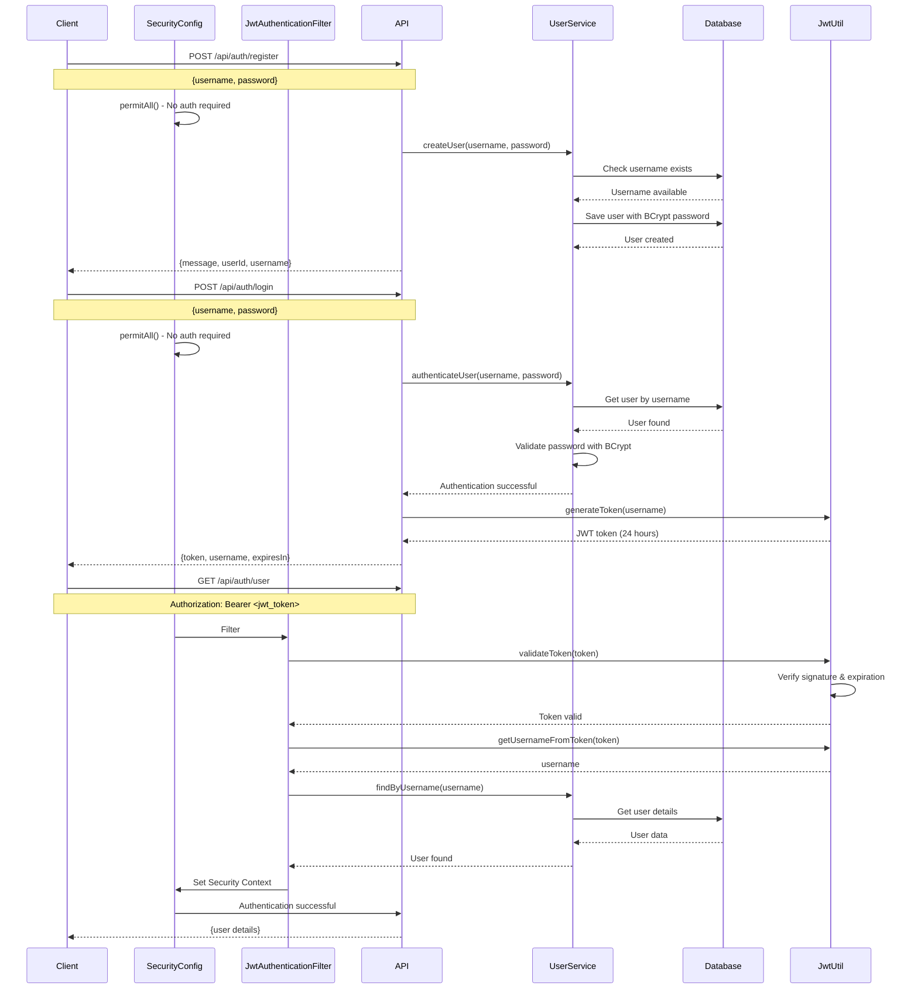
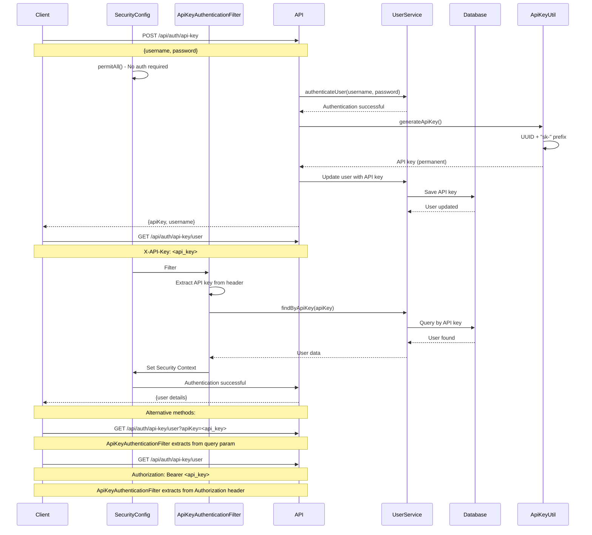
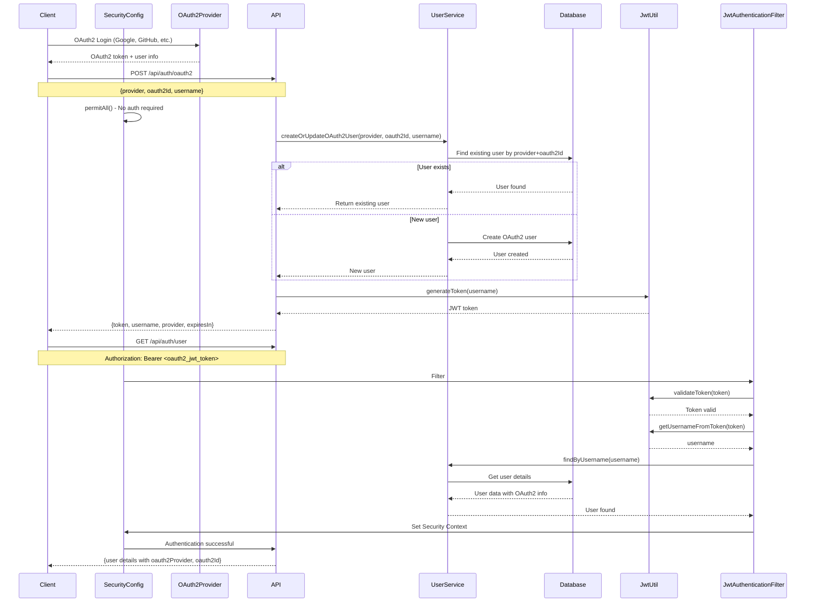
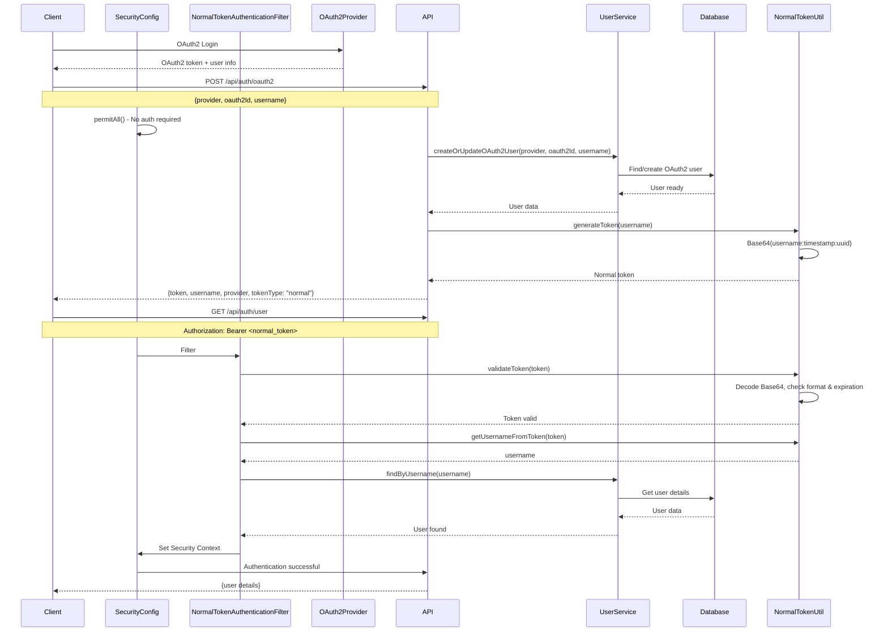
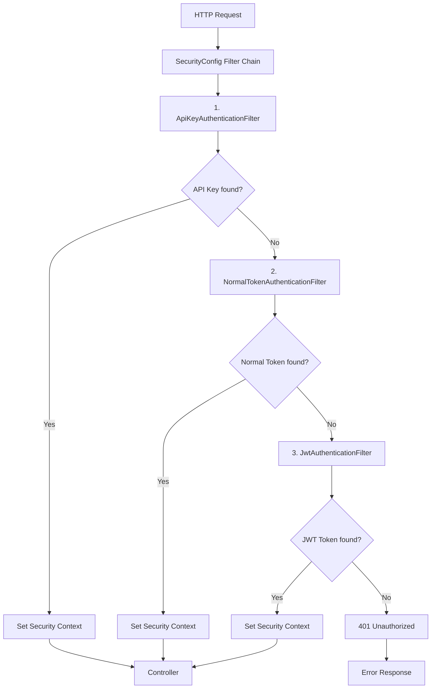

# 4 Authentication Flow Diagrams with SecurityConfig

## Overview

Complete flow diagrams including SecurityConfig implementation and filter chain configuration for all authentication methods.

## SecurityConfig Implementation

### SecurityConfig Class Structure
```java
@Configuration
@EnableWebSecurity
@EnableMethodSecurity
@RequiredArgsConstructor
public class SecurityConfig {
    private final UserService userService;
    private final JwtAuthenticationFilter jwtAuthenticationFilter;
    private final ApiKeyAuthenticationFilter apiKeyAuthenticationFilter;
    private final NormalTokenAuthenticationFilter normalTokenAuthenticationFilter;
    
    @Bean
    public SecurityFilterChain securityFilterChain(HttpSecurity http) {
        http.csrf().disable()
            .sessionManagement().sessionCreationPolicy(STATELESS)
            .authorizeHttpRequests()
                .requestMatchers("/api/auth/register", "/api/auth/login", "/api/auth/oauth2").permitAll()
                .requestMatchers("/api/auth/api-key", "/api/auth/user/{username}", "/api/auth/users").permitAll()
                .requestMatchers("/h2-console/**", "/actuator/**").permitAll()
                .anyRequest().authenticated()
            .and()
            .addFilterBefore(apiKeyAuthenticationFilter, UsernamePasswordAuthenticationFilter.class)
            .addFilterBefore(normalTokenAuthenticationFilter, UsernamePasswordAuthenticationFilter.class)
            .addFilterBefore(jwtAuthenticationFilter, UsernamePasswordAuthenticationFilter.class);
        return http.build();
    }
}
```

---

## 1. JWT Authentication (Default)

### Complete Flow with SecurityConfig


### SecurityConfig Integration
- **Filter Position**: 3rd in filter chain (after API Key and Normal Token)
- **Endpoints**: `/api/auth/user` requires authentication
- **Validation**: JWT signature verification with JwtUtil
- **Security Context**: UsernamePasswordAuthenticationToken set

---

## 2. API Key Authentication

### Complete Flow with SecurityConfig


### SecurityConfig Integration
- **Filter Position**: 1st in filter chain (highest priority)
- **Endpoints**: `/api/auth/api-key/user` requires authentication
- **Validation**: Database lookup with UserService
- **Security Context**: UsernamePasswordAuthenticationToken set with username

---

## 3. OAuth2 Authentication (JWT Version)

### Complete Flow with SecurityConfig


### SecurityConfig Integration
- **Filter Position**: Uses JwtAuthenticationFilter (3rd in chain)
- **Endpoints**: `/api/auth/oauth2` is public, `/api/auth/user` requires auth
- **Validation**: JWT token generated after OAuth2 user creation
- **Security Context**: Standard JWT authentication flow

---

## 4. OAuth2 Authentication (Normal Token Version)

### Complete Flow with SecurityConfig


### SecurityConfig Integration
- **Filter Position**: 2nd in filter chain (after API Key, before JWT)
- **Endpoints**: `/api/auth/oauth2` is public, `/api/auth/user` requires auth
- **Validation**: NormalTokenUtil validates Base64 format and timestamp
- **Security Context**: UsernamePasswordAuthenticationToken set with extracted username

---

## SecurityConfig Filter Chain Configuration

### Filter Chain Order


### SecurityConfig URL Rules
```yaml
# Public endpoints (no authentication required)
/api/auth/register
/api/auth/login  
/api/auth/oauth2
/api/auth/api-key
/api/auth/user/{username}
/api/auth/users
/h2-console/**
/actuator/**

# Protected endpoints (authentication required)
/api/auth/user
/api/secure/**
```

---

## SecurityConfig Beans Configuration

### Essential Beans
```java
@Bean
public PasswordEncoder passwordEncoder() {
    return new BCryptPasswordEncoder();  // For password hashing
}

@Bean  
public AuthenticationManager authenticationManager(AuthenticationConfiguration config) {
    return config.getAuthenticationManager();  // For authentication
}

@Bean
public SecurityFilterChain securityFilterChain(HttpSecurity http) {
    // Filter chain configuration with all 3 authentication filters
}
```

---

## Comparison Summary with SecurityConfig

| Authentication Method | Filter in SecurityConfig | Filter Position | Validation Method | Security Context |
|----------------------|--------------------------|----------------|------------------|-----------------|
| **API Key** | ApiKeyAuthenticationFilter | 1st (highest priority) | Database lookup | Username from API key |
| **Normal Token** | NormalTokenAuthenticationFilter | 2nd | Base64 + timestamp | Username from token |
| **JWT** | JwtAuthenticationFilter | 3rd (lowest priority) | JWT signature | Username from JWT |
| **OAuth2** | Uses JWT or Normal Token filter | Depends on token type | OAuth2 + token validation | OAuth2 user data |

### Database Schema
```sql
USER {
  id: Long (Primary Key)
  username: String (Unique)
  password: String (BCrypt encrypted)
  api_key: String (Unique, nullable)
  oauth2_provider: String (nullable)
  oauth2_id: String (nullable)
}
```

All authentication methods are integrated through SecurityConfig with proper filter chain ordering and Spring Security context management.
